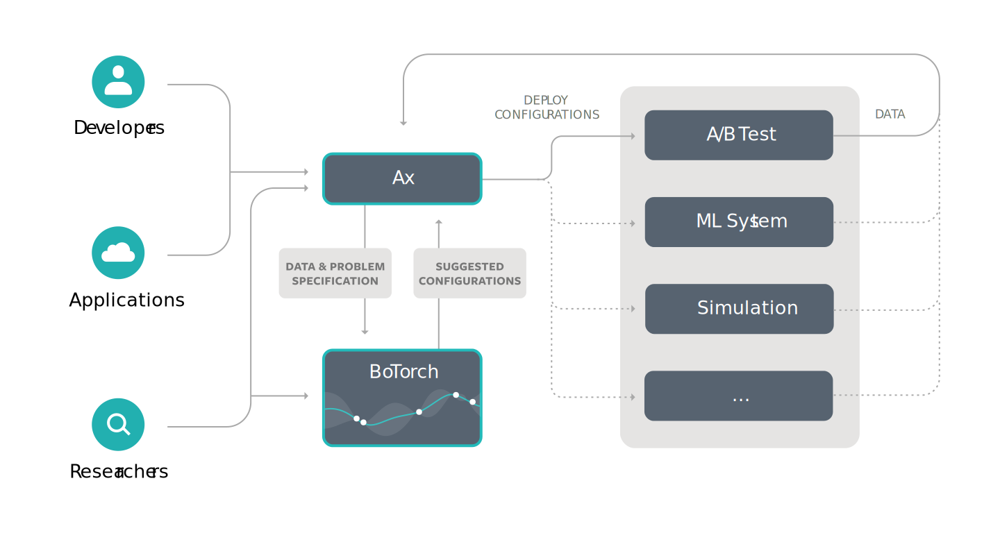

[Ax](https://ax.dev) is a platform for sequential experimentation. It relies on
BoTorch for implementing Bayesian Optimization algorithms, but provides
higher-level APIs that make it easy and convenient to specify problems,
visualize results, and benchmark new algorithms. It also comes with powerful
metadata management, storage of results, and deployment-related APIs. Ax makes
it convenient to use BoTorch in most standard Bayesian Optimization settings.
Simply put, BoTorch provides the building blocks for the engine, while Ax makes
it easy to drive the car.

Ax provides a
[`BotorchGenerator`](https://https://ax.readthedocs.io/en/latest/models.html#ax.generators.torch.botorch.BotorchModel)
that is a sensible default for modeling and optimization which can be customized
by specifying and passing in bespoke model constructors, acquisition functions,
and optimization strategies. This model bridge utilizes a number of built-in
transformations, such as normalizing input spaces and outputs to ensure
reasonable fitting of GPs. See the
[Ax Docs](https://ax.dev/docs/models.html#transforms) for more information.

## When to use BoTorch through Ax

If it's simple to use BoTorch through Ax for your problem, then use Ax. It
dramatically reduces the amount of bookkeeping one needs to do as a Bayesian
optimization researcher, such as keeping track of results, and transforming
inputs and outputs to ranges that will ensure sensible handling in (G)PyTorch.
The functionality provided by Ax should apply to most standard use cases.

Even if you want something more custom, it may still be easier to use the Ax
framework. For instance, say you want to experiment with using a different kind
of surrogate model, or a new type of acquisition function, but leave the rest of
the the Bayesian Optimization loop untouched. It is then straightforward to plug
your custom BoTorch model or acquisition function into Ax to take advantage of
Ax's various loop control APIs, as well as its powerful automated metadata
management, data storage, etc. See Ax's
[Modular BoTorch tutorial](https://ax.dev/docs/tutorials/modular_botorch/)
tutorial for more on how to do this.

## When not to use Ax

If you're working in a non-standard setting, such as structured feature or
design spaces, or where the model fitting process requires interactive work,
then using Ax may not be the best solution for you. In such a situation, you
might be better off writing your own full Bayesian Optimization loop in BoTorch.
The [q-Noisy Constrained EI](tutorials/closed_loop_botorch_only) tutorial and
[variational auto-encoder](tutorials/vae_mnist) tutorial give examples of how
this can be done.

You may also consider working purely in BoTorch if you want to be able to
understand and control every single aspect of your BayesOpt loop - Ax's
simplicity necessarily means that certain powerful BoTorch features will not be
fully exposed to the user.

## Prototyping in BoTorch

The modular design of BoTorch makes it very easy to prototype and debug
individual components in an interactive fashion in a Jupyter notebook just like
you might do with PyTorch. Once these building blocks have been designed and
tested, they can easily be integrated into Ax.
